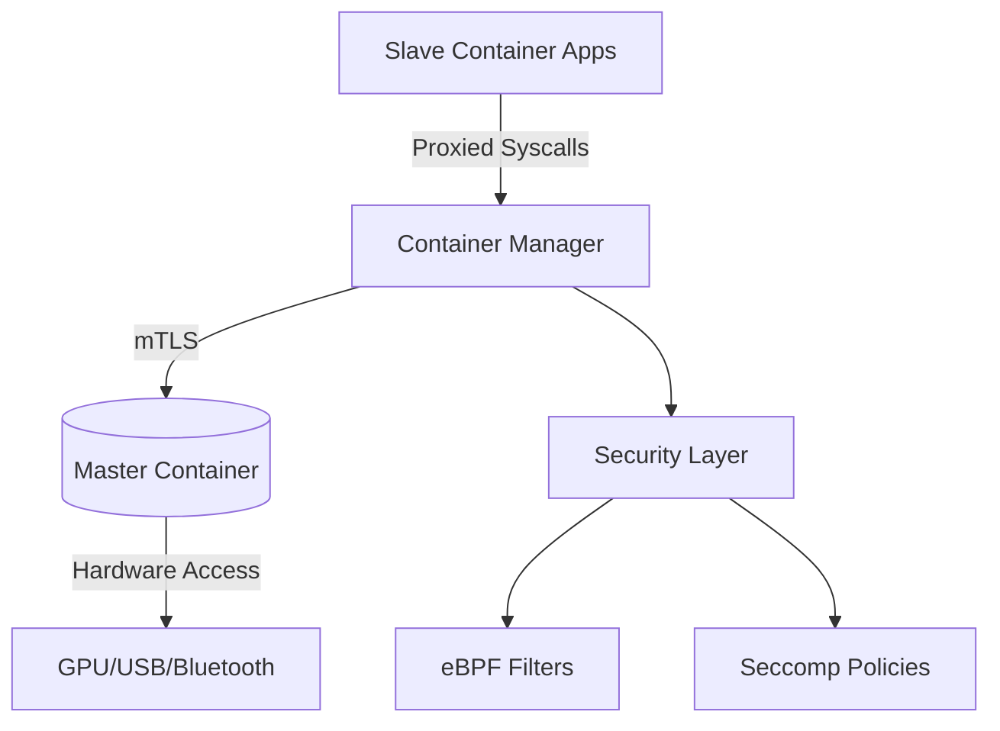

# SeraphimOS  
*A Minimal, Container-Centric OS with Hardware Isolation*  

---

## 📖 Overview  
SeraphimOS is a lightweight operating system designed to run applications in isolated containers, with a strict separation between hardware-accessing "master" containers and restricted "slave" containers. Built on **Alpine Linux** and leveraging **Rust** for low-level container management, it enforces kernel-level isolation via namespaces/cgroups and provides transparent hardware proxying.  

**Key Concepts**:  
- **Master Container**: Exclusive hardware access (GPIO, USB, Bluetooth, etc.).  
- **Slave Containers**: Isolated environments where apps interact with hardware via the master.  
- **Container Manager**: Rust-based orchestration layer for lifecycle, security, and communication.  

---

## ✨ Features  
- **Hardware Isolation**: Only the master container interacts with physical devices.  
- **Security-First**:  
  - Seccomp-BPF syscall filtering.  
  - eBPF-powered request validation.  
  - Mandatory Access Control (SELinux/AppArmor integration).  
- **Transparent Communication**:  
  - Unix domain sockets + mTLS-encrypted channels.  
  - Automatic syscall redirection (e.g., `/dev` access in slaves → proxied to master).  
- **Dynamic Hardware Management**:  
  - Hot-plug device support via udev rules.  
  - Hardware whitelisting/blacklisting.  
- **Alpine + Rust Stack**:  
  - Musl libc for lightweight binaries.  
  - Rust memory safety for critical components.  

---

## 🚀 Getting Started  

### Prerequisites  
- Linux kernel ≥5.15 (with namespaces/cgroups enabled).  
- Rust toolchain (`rustup`, `cargo`).  
- Alpine SDK (`apk-tools`, `abuild`).  

### Build & Run  
1. Clone the repo:  
   ```bash  
   git clone https://github.com/rboivin2018/SeraphimOS.git  
   cd SéraphimOS
   ```  

2. Configure hardware rules (optional):  
   ```bash  
   cp configs/hardware_whitelist.example.toml /etc/containos/hardware.toml  
   ```  

3. Build the container manager:  
   ```bash  
   cargo build --release --target x86_64-unknown-linux-musl  
   ```  

4. Initialize the master container:  
   ```bash  
   sudo ./target/release/container_manager master-init \  
     --hardware-config /etc/containos/hardware.toml  
   ```  

5. Create a slave container:  
   ```bash  
   sudo ./target/release/container_manager slave-create \  
     --name my_slave \  
     --cpu-quota 50% \  
     --memory 512MB  
   ```  

---

## 🏗️ Architecture  


### Core Components  
1. **Container Manager** (Rust):  
   - Lifecycle management (create/delete containers).  
   - Hardware permission API (`GET /hardware`, `POST /attach_device`).  
2. **Hardware Proxy** (Rust + eBPF):  
   - Syscall interception/redirection.  
   - Virtual device emulation (e.g., `/dev/virtual_bt`).  
3. **Security Layer**:  
   - eBPF-powered syscall validation.  
   - TPM-signed audit logs.  
4. **Communication Module**:  
   - Async I/O with `tokio`.  
   - mTLS handshake via `rustls`.  

---

## 🔒 Security Deep Dive  
ContainOS implements a **zero-trust** model:  
1. **Kernel Hardening**:  
   ```bash  
   sysctl -w kernel.unprivileged_userns_clone=0  
   sysctl -w kernel.kptr_restrict=2  
   ```  
2. **Encrypted IPC**: All master-slave communication uses AES-256-GCM.  
3. **Auditability**:  
   - Tamper-proof logs signed with TPM.  
   - SPDX-compliant license tracking.  

---

## 🤝 Contributing  
1. Fork the repository.  
2. Create a feature branch: `git checkout -b feat/your-feature`.  
3. Test changes with `cargo test --all-features`.  
4. Submit a PR with a detailed description.  

**Guidelines**:  
- Follow Rust’s `clippy` and `fmt` standards.  
- Document security-critical code with `# Safety` comments.  

---

## 📜 License  
GNU License  (compatible with Alpine’s MIT/BSD licensing).

📚 References

(Alpine Linux Documentation)[]
(Rust Security Best Practices)[]
(Linux Kernel Namespaces)[]
(eBPF and Kernel Security)[]
(mTLS Implementation Guide)[]
